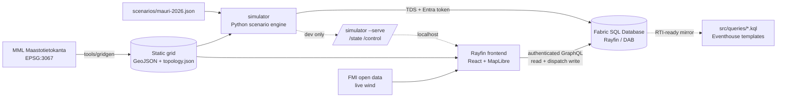

# Verkkovahti — storm operations control room

A real-time **storm operations control room** for a Finnish electricity DSO,
demoed on the municipality of **Sysmä**. Dispatchers watch grid outages and field
crews live on a map and dispatch crews; a scenario player replays a synthetic
storm (**Myrsky Mauri**) over a compressed timeline (~10 min demo ≈ 4 h
simulated). Built as a **Rayfin** app on **Microsoft Fabric**.

> Dark theme · Finnish place names · English UI · term **käyttöpaikat** kept ·
> tabular numerals · no colour-only status (feeders are dashed **and** red).

 ·
Live (in Fabric portal): `https://close-fawn-c8c9977a06-swedencentral.webapp.fabricapps.net`

---

## Architecture



- **Static, geographically-honest grid** (`tools/gridgen`) built from local MML
  data: ~2,879 real building points → **käyttöpaikat**, 144 k-means
  **transformers**, 2 **substations** seeded from real electrical points, and 6
  **feeders** routed along the real road network with a parent/child
  **radial topology**.
- **Downstream traversal implemented once** (`shared/topology`) and pre-computed
  into a per-segment closure consumed by *both* the simulator (affected counts)
  and the frontend (fault → downstream highlight, KPIs).
- **Simulator** replays the storm into the **Fabric SQL Database over TDS**;
  the frontend reads live state via **authenticated Rayfin GraphQL** in the
  Fabric portal (a local dev HTTP server stands in outside the portal).
- **Real-Time-ready**: `src/queries/*.kql` mirror the SQL entities so a Fabric
  Eventstream → Eventhouse can be substituted without changing the frontend.

See [`RAYFIN-FEEDBACK.md`](./RAYFIN-FEEDBACK.md) for a dated log of Rayfin/Fabric
friction and wins, and [`DEPLOY.md`](./DEPLOY.md) to redeploy against another
municipality.

## Repository layout

```
config/            municipality + basemap + db config (reusability knobs)
tools/gridgen/     one-time MML → synthetic Sysmä grid generator (+ output/)
shared/topology/   canonical radial downstream-traversal lib (unit-tested)
scenarios/         storm scenario (mauri-2026.json)
simulator/         Python scenario engine + TDS writer + dev HTTP server
src/queries/       runnable KQL template assets (Eventhouse)
src/               React + TypeScript control room (MapLibre GL)
rayfin/            Rayfin data model (@entity) + Fabric config
scripts/           asset sync (grid + config → public/data)
```

## Prerequisites

- Node 20+, Python 3.11+, the **Azure CLI** (`az login`), and the
  **ODBC Driver 18 for SQL Server**.
- Access to the Fabric workspace with the deployed data app.

```bash
npm install
python -m pip install -r tools/gridgen/requirements.txt -r simulator/requirements.txt
python tools/gridgen/gridgen.py          # regenerate the grid (optional; output is committed)
```

Copy `config/db.example.json` → `config/db.local.json` and
`config/basemap.example.json` → `config/basemap.local.json` (MML WMTS key). Get
the SQL DB values from
`GET /v1/workspaces/{ws}/SQLDatabases/{id}` (see DEPLOY.md).

## 10-step demo script

Two ways to run it. **A) Local** (fastest, reset button enabled).
**B) Fabric portal** (the real target; Fabric SSO).

### A) Local demo
1. `az login` (Entra token for the SQL DB).
2. `python -m simulator seed` — crews at depots, scenario idle.
3. `python -m simulator run --serve --tick 1` — start the engine + dev server.
4. `npm run dev:web` — open http://localhost:5173. You see the Sysmä grid, all
   feeders green, **NORMAALITILANNE**.
5. Press **▶** in the top bar. The storm begins; the wind chip climbs.
6. Faults appear **NW→SE** behind the front; affected feeders turn **dashed
   red**, transformers flip, faults pulse, and the KPIs (käyttöpaikat pimeänä,
   vakiokorvausriski €) climb.
7. Click a fault (map or queue) → its **downstream** network highlights and the
   detail panel opens. Note the 639-käyttöpaikka feeder trip and the remote
   **lakeside** fault (slow to reach).
8. Hit **Ehdota partiota** (suggest) or **drag** an incident card onto a crew
   row to dispatch — the crew turns *Matkalla*.
9. Watch crews drive to sites, repair, and **restore power**: feeders go green,
   incidents clear, KPIs fall. Adjust **speed** (12–96×) as needed.
10. Press **⟲** to reset and replay. Runs clean end-to-end in ~10 min.

### B) Fabric portal demo
Deploy with `npx rayfin up` and open the app from the workspace item **inside
the Fabric portal**. The simulation runs **entirely in the browser** (from the
bundled scenario + topology), so there is nothing to start server-side — just
press **▶**, pick a speed, toggle **AUTO** dispatch, and use the map basemap
switch (**Map / Dark / Satellite**). No local process is required.

> The Rayfin **Fabric SQL Database** path (data model + the Python simulator
> writing over TDS + the KQL templates) remains available as the "server-side /
> real-time-ready" alternative — see below and `DEPLOY.md`. It is not required
> for the deployed demo to run.

## Tests

```bash
python -m pytest shared/topology tools/gridgen -q   # topology + gridgen output (9)
npm test                                            # ETA/compensation/topology (8)
npm run build                                        # TypeScript strict + vite
```

## Reusability

Everything municipality-specific lives in `config/municipality.sysma.json`
(name, centre, substation seeds, feeder count, compensation tiers, FMI place).
Point `tools/gridgen` at another MML sheet + config and re-run to generate a new
grid — see `DEPLOY.md`.

## Non-goals

Route optimization, crew mobile app, extra auth/roles, historical analytics,
multi-municipality UI, real SCADA/DMS integration (the simulator is the
stand-in; its event schema is kept clean so a real integration would slot in).
