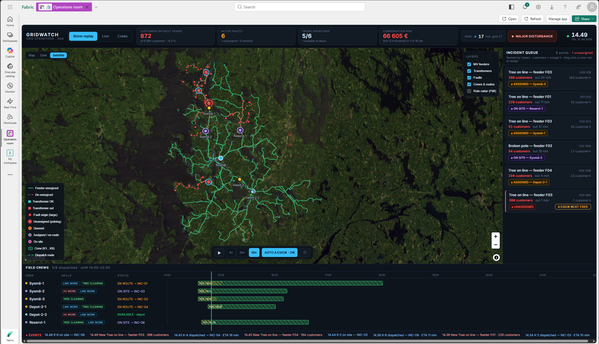
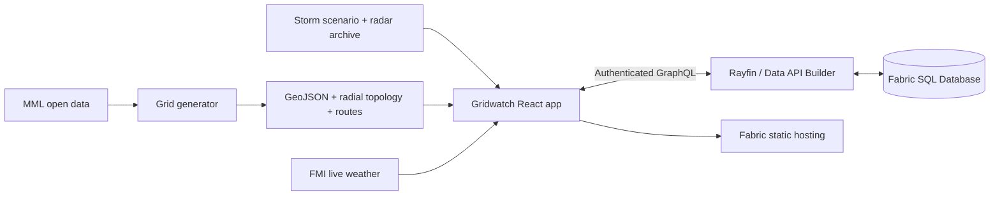

# Gridwatch

**A storm operations control room that helps electricity distribution operators
see impact, dispatch the right crew, and restore power faster.**



[Watch the 85-second demo](./docs/Operation%20Room.mp4)

## The problem

During a storm, a dispatcher's operating picture is fragmented across outage
management, workforce tools, weather services, and spreadsheets. The hardest
questions are answered too slowly:

- Which fault has the greatest downstream customer impact?
- Which qualified crew can reach it fastest?
- How is the outage affecting statutory compensation exposure?

Gridwatch brings those decisions into one shared, real-time operating picture.

## What Gridwatch does

- **Prioritizes impact.** Faults are ranked by customer impact multiplied by
  outage duration. Selecting one highlights its entire downstream network.
- **Coordinates field response.** Dispatchers can assign the nearest qualified
  crew, reserve the next available team, and follow travel along real road
  routes.
- **Tracks restoration.** A live Gantt shows crew availability, travel, repairs,
  scheduled work, and expected completion while outage KPIs update.
- **Adds weather context.** Live FMI wind and rain radar support daily
  operations; an archived radar sequence stays synchronized with the storm
  replay.
- **Supports calm days and crisis response.** Live mode covers maintenance and
  minor outages. Storm replay compresses four hours of Storm Mauri into a
  repeatable ten-minute exercise.

## A real geographic demo

The Sysmä demo is synthetic but geographically grounded in Finnish National
Land Survey open data:

| Grid asset | Demo scale |
|---|---:|
| Customer connection points | 6,080 |
| Distribution transformers | 180 |
| Primary substations | 2 |
| Medium-voltage feeders | 6 |

Feeders follow the real road network and form a radial topology, enabling
accurate downstream impact calculations. The grid generator can rebuild the
same experience for any Finnish municipality.

## Why it stands out

Gridwatch is a working operational flow, not a dashboard mock-up:

1. Weather moves across the grid.
2. Faults de-energize downstream customers.
3. The queue reprioritizes incidents and compensation risk.
4. Qualified crews are dispatched over road-based routes.
5. Repairs restore feeders and the KPIs recover.

The demo runs entirely in the browser from bundled scenario and topology data,
so it is deterministic and presentation-ready without a simulator service.

## Built with Rayfin and Microsoft Fabric

- **Rayfin** code-first entities and authenticated, type-safe data access
- **Fabric SQL Database** exposed through Data API Builder GraphQL
- **Fabric SSO** for embedded authentication
- **Fabric static hosting** for the React application
- **React, TypeScript, MapLibre GL, and Vite** for the control-room experience
- **Python, GeoPandas, NetworkX, and MML open data** for grid generation
- **KQL templates** for a future Eventstream and Eventhouse real-time path



## Run locally

Prerequisite: Node.js 20 or newer.

```bash
npm install
npm run dev:web
```

Open `http://localhost:5173`, select **Storm replay**, press play, and choose a
speed. Use **Auto assign** for a hands-off run or dispatch incidents manually.

For the full presenter walkthrough, see [`docs/DEMO.md`](./docs/DEMO.md).

## Deploy to Fabric

```bash
npx rayfin login
npx rayfin up
npx rayfin up status
```

## Validate

```bash
npm test
npm run lint
npm run build
python -m pytest shared/topology tools/gridgen -q
```

## Repository map

```text
src/                React control room and browser simulation
rayfin/             Rayfin entities and Fabric configuration
tools/gridgen/      Municipality-scale grid generator
shared/topology/    Canonical downstream traversal
scenarios/          Storm and normal-operations scenarios
assets/radar/       Deterministic storm radar archive
simulator/          Optional server-side scenario engine
docs/               Demo video, screenshot, and presenter guide
```
