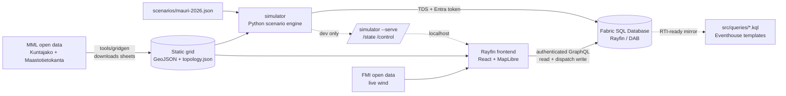

# Verkkovahti — storm operations control room

A real-time **storm operations control room** for a Finnish electricity DSO,
demoed on the municipality of **Sysmä**. Dispatchers watch grid outages and field
crews live on a map and dispatch crews; a scenario player replays a synthetic
storm (**Myrsky Mauri**) over a compressed timeline (~10 min demo ≈ 4 h
simulated). Built as a **Rayfin** app on **Microsoft Fabric**.

> Dark theme · Finnish place names · English UI · term **käyttöpaikat** kept ·
> tabular numerals · no colour-only status (feeders are dashed **and** red).

 ·
Live (in Fabric portal): `https://close-fawn-c8c9977a06-swedencentral.webapp.fabricapps.net`

**📹 Demo video (~2 min):** _TODO — add link before submitting._

---

## The problem

When a storm crosses a Finnish distribution grid, the dispatcher's operating
picture fragments. Outage data sits in SCADA/DMS, crew locations in a workforce
tool, the weather front in a browser tab, and customer impact in a spreadsheet —
so the questions that actually decide the shift get answered slowly and by gut
feel:

- **Which fault hurts most?** A fault's real cost is not its location but
  everything *downstream* of it — how many **käyttöpaikat** (customer connection
  points) go dark, and for how long.
- **Which crew should go, and when will power be back?** Travel time on real
  roads, crew skills, and shift ends all matter.
- **What is this outage costing?** Finnish DSOs owe statutory **vakiokorvaus**
  compensation that escalates with outage duration, so restoring the right
  feeder first is a direct euro decision.

Every minute spent reconciling four screens is a minute of outage the regulator
and the customer both bill for.

## Who it's for

**Primary user: the control-room dispatcher (käytönvalvoja) at a Finnish
electricity DSO** — the person on shift who must keep situational awareness on a
calm day and triage, prioritize and dispatch under storm load. Secondary users:
the operations manager reviewing restoration performance and compensation
exposure, and field crew leads receiving assignments.

## What we built

**Verkkovahti** — one screen that fuses grid state, customer impact, weather and
field crews into a single operating picture, with dispatch as a first-class
action:

- A **geographically honest** synthetic Sysmä grid built from real national map
  data (2,879 real building points → käyttöpaikat, 144 transformers, 2
  substations, 6 feeders routed along the real road network) with a radial
  parent/child topology — generated by a CLI that can rebuild the same for
  **any** of Finland's ~309 municipalities, downloading the map sheets it needs
  on demand.
- **Impact-first triage**: click any fault and the whole **downstream** network
  highlights; the incident queue is ranked by *käyttöpaikat × outage hours*, and
  KPIs show live customers-without-power and **vakiokorvaus risk in €**.
- **Dispatch you can actually do**: suggest-nearest-skilled-crew or drag an
  incident card onto a crew row in the Gantt; crews then drive real road routes
  to site, repair, and restore power, and the KPIs fall.
- **Two presenter modes**: a **Live** blue-sky shift (live FMI wind + live rain
  radar, scheduled maintenance, small unscheduled outages) and a **Storm replay**
  of *Myrsky Mauri* — ~4 h of storm compressed into a ~10 min demo, with the rain
  radar synced to the simulated clock.
- Deployed as a **Rayfin data app on Microsoft Fabric**: code-first `@entity`
  data model → Fabric SQL Database via DAB, authenticated GraphQL read/write,
  and Vite static hosting — all from `rayfin up`.

An earlier concept pitch for the same idea (before the Sysmä build) lives in
[`docs/concept/`](./docs/concept/) as a PNG, a PDF and a standalone HTML page.

## Architecture



- **Static, geographically-honest grid** (`tools/gridgen`) built from MML open
  data. The committed demo grid covers Sysmä: 2,879 real building points →
  **käyttöpaikat**, 144 k-means **transformers**, 2 **substations** seeded from
  real electrical points, and 6 **feeders** routed along the real road network
  with a parent/child **radial topology**. The generator is a CLI that works for
  **any Finnish municipality** — it resolves the municipality against the
  national Kuntajako, computes which 12×12 km map sheets cover it, and downloads
  them on demand (so it is no longer limited to one hand-downloaded sheet).
- **Downstream traversal implemented once** (`shared/topology`) and pre-computed
  into a per-segment closure consumed by *both* the simulator (affected counts)
  and the frontend (fault → downstream highlight, KPIs).
- **Simulator** replays the storm into the **Fabric SQL Database over TDS**;
  the frontend reads live state via **authenticated Rayfin GraphQL** in the
  Fabric portal (a local dev HTTP server stands in outside the portal).
- **Real-Time-ready**: `src/queries/*.kql` mirror the SQL entities so a Fabric
  Eventstream → Eventhouse can be substituted without changing the frontend.

See [`RAYFIN-FEEDBACK.md`](./RAYFIN-FEEDBACK.md) for a dated log of Rayfin/Fabric
friction and wins, and [`DEPLOY.md`](./DEPLOY.md) to redeploy against another
municipality.

## Repository layout

```
config/            municipality + basemap + db config (reusability knobs)
tools/gridgen/     MML downloader + grid generator CLI (+ output/)
shared/topology/   canonical radial downstream-traversal lib (unit-tested)
scenarios/         storm scenario (mauri-2026.json)
simulator/         Python scenario engine + TDS writer + dev HTTP server
src/queries/       runnable KQL template assets (Eventhouse)
src/               React + TypeScript control room (MapLibre GL)
rayfin/            Rayfin data model (@entity) + Fabric config
scripts/           asset sync (grid + config → public/data)
```

## Prerequisites

- Node 20+, Python 3.11+, the **Azure CLI** (`az login`), and the
  **ODBC Driver 18 for SQL Server**.
- Access to the Fabric workspace with the deployed data app.

```bash
npm install
python -m pip install -r tools/gridgen/requirements.txt -r simulator/requirements.txt
```

> No manual map-data setup: `tools/gridgen` downloads the MML sheets it needs.
> The Sysmä grid is committed, so you only need to regenerate it to target a
> different municipality — see [`tools/gridgen/README.md`](./tools/gridgen/README.md).
> Regenerating changes the `seg_id`s that `scenarios/mauri-2026.json` references,
> so `build` requires `--force` (or write elsewhere with `--out`).

Copy `config/db.example.json` → `config/db.local.json` and
`config/basemap.example.json` → `config/basemap.local.json` (MML WMTS key). Get
the SQL DB values from
`GET /v1/workspaces/{ws}/SQLDatabases/{id}` (see DEPLOY.md).

## View modes

The top bar switches between two views:

- **Storm replay** (default): replays the recorded storm (Myrsky Mauri) with the
  full player (play/pause, 8/24/60×, AUTO dispatch, reset). When the **Rain radar
  (FMI)** layer is on, the radar is **synced to the simulated clock** — anchored
  into FMI's real ~7-day archive window — so real rain frames advance with the
  replay (label shows the historical time).
- **Live**: real-time / normal-operations monitoring — the grid resets to its
  healthy state, the clock shows the current time, and the radar shows the latest
  live frames with a scrub slider + loop.

## 10-step demo script

> For the full presenter guide — including the **normal operations** ("blue-sky
> day") walkthrough and the transition into the storm — see
> [`docs/DEMO.md`](./docs/DEMO.md).

Two ways to run it. **A) Local** (fastest, reset button enabled).
**B) Fabric portal** (the real target; Fabric SSO).

### A) Local demo
1. `az login` (Entra token for the SQL DB).
2. `python -m simulator seed` — crews at depots, scenario idle.
3. `python -m simulator run --serve --tick 1` — start the engine + dev server.
4. `npm run dev:web` — open http://localhost:5173. You see the Sysmä grid, all
   feeders green, **NORMAALITILANNE**.
5. Press **▶** in the top bar. The storm begins; the wind chip climbs.
6. Faults appear **NW→SE** behind the front; affected feeders turn **dashed
   red**, transformers flip, faults pulse, and the KPIs (käyttöpaikat pimeänä,
   vakiokorvausriski €) climb.
7. Click a fault (map or queue) → its **downstream** network highlights and the
   detail panel opens. Note the 639-käyttöpaikka feeder trip and the remote
   **lakeside** fault (slow to reach).
8. Hit **Ehdota partiota** (suggest) or **drag** an incident card onto a crew
   row to dispatch — the crew turns *Matkalla*.
9. Watch crews drive to sites, repair, and **restore power**: feeders go green,
   incidents clear, KPIs fall. Adjust **speed** (12–96×) as needed.
10. Press **⟲** to reset and replay. Runs clean end-to-end in ~10 min.

### B) Fabric portal demo
Deploy with `npx rayfin up` and open the app from the workspace item **inside
the Fabric portal**. The simulation runs **entirely in the browser** (from the
bundled scenario + topology), so there is nothing to start server-side — just
press **▶**, pick a speed, toggle **AUTO** dispatch, and use the map basemap
switch (**Map / Dark / Satellite**). No local process is required.

> The Rayfin **Fabric SQL Database** path (data model + the Python simulator
> writing over TDS + the KQL templates) remains available as the "server-side /
> real-time-ready" alternative — see below and `DEPLOY.md`. It is not required
> for the deployed demo to run.

## Tests

```bash
python -m pytest shared/topology tools/gridgen -q   # sheet grid + topology + generated output (41)
npm test                                            # ETA/compensation/topology (15)
npm run build                                       # TypeScript strict + vite
```

## Reusability

Everything municipality-specific lives in `config/municipality.sysma.json`
(name, kunta code, centre, feeder/substation counts, compensation tiers, FMI
place) — and `tools/gridgen` fetches the map data for whichever municipality you
name:

```bash
python -m tools.gridgen config -m Kuhmoinen              # starter config
python -m tools.gridgen build  -m Kuhmoinen --out tools/gridgen/output-kuhmoinen
```

See [`DEPLOY.md`](./DEPLOY.md) for the full redeploy walkthrough.

## Non-goals

Route optimization, crew mobile app, extra auth/roles, historical analytics,
multi-municipality UI, real SCADA/DMS integration (the simulator is the
stand-in; its event schema is kept clean so a real integration would slot in).
